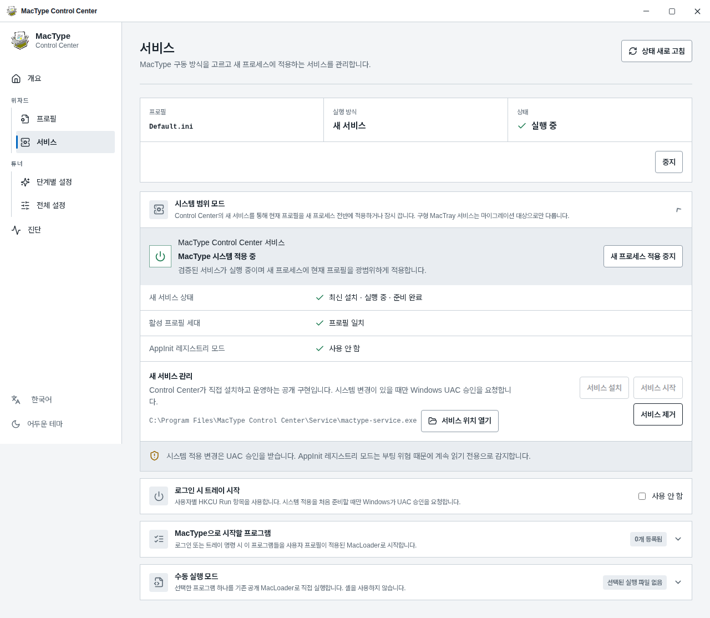
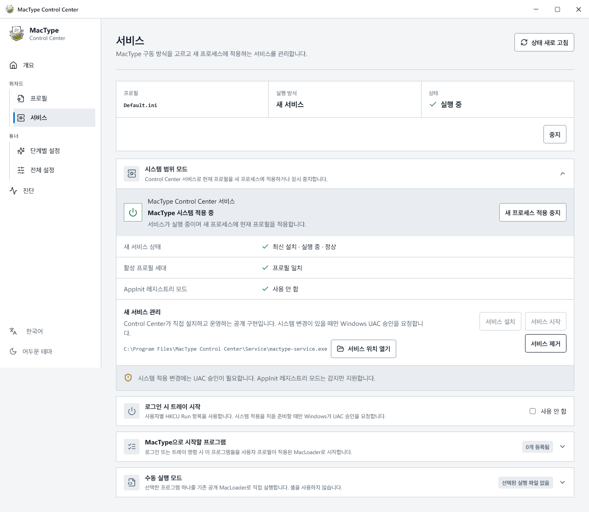
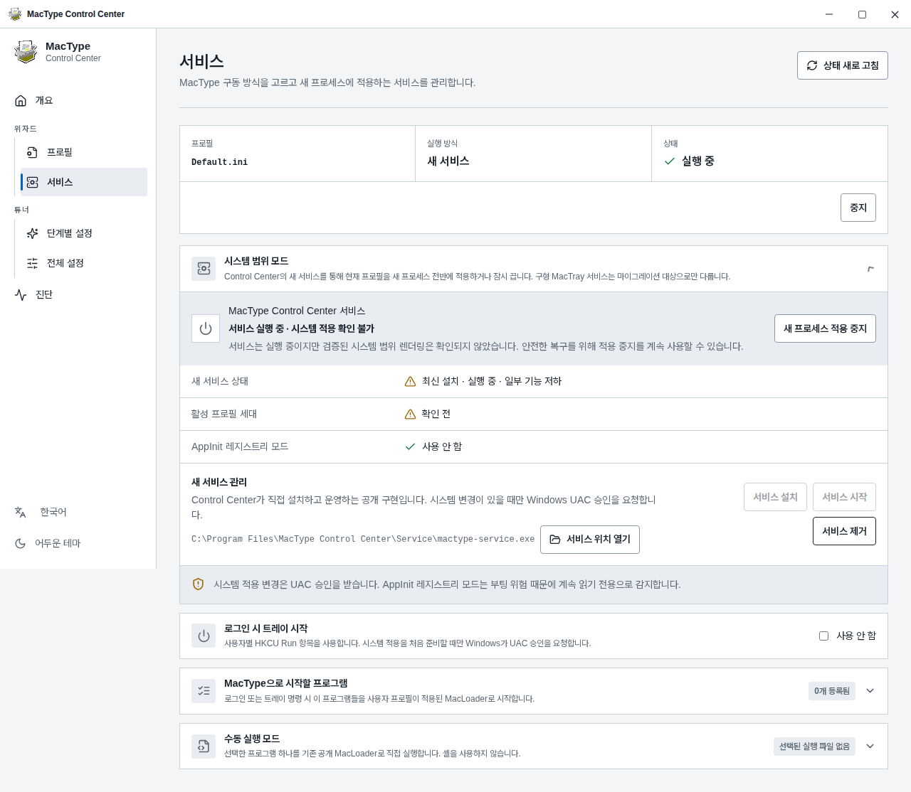
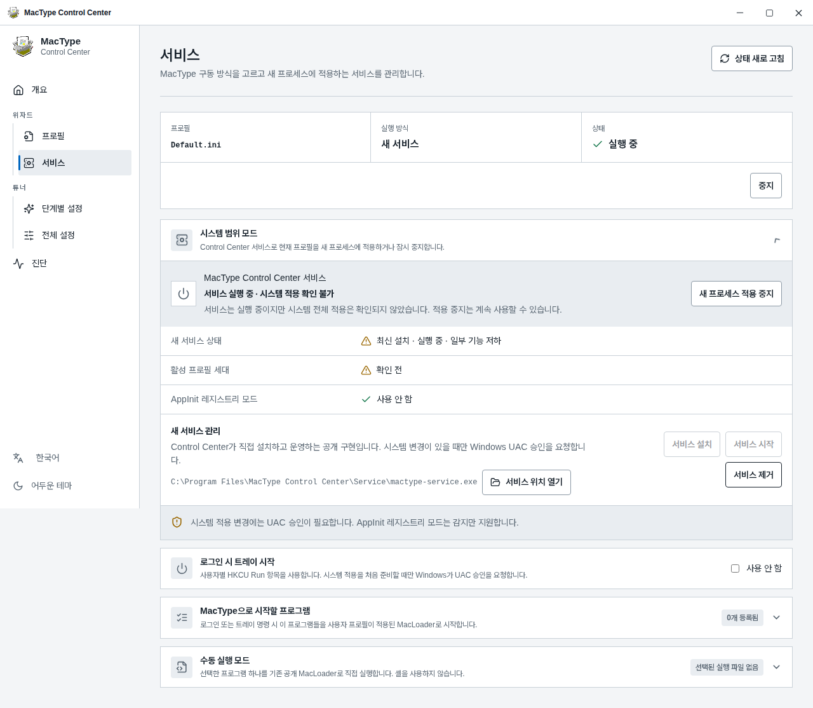
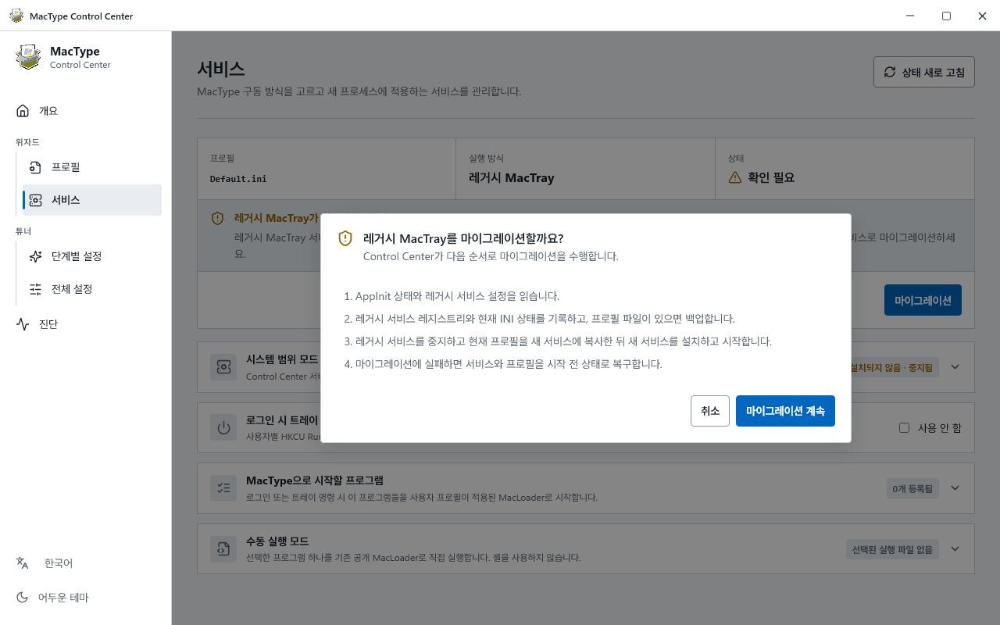

# 데스크톱 문구 비교 갤러리

모든 이미지는 실제 1280×800 데스크톱 앱 화면이다. 휴대폰에서는 이미지를 눌러
원본 크기로 열고 확대해서 볼 수 있다.

## 1. 정상 실행 상태

기능 소개에서 “마이그레이션 대상으로만”을 없애고, 정상 상태의 “검증된”과
“광범위하게”를 실제 동작 설명으로 바꿨다.

### 변경 전

### 변경 후

## 2. 시스템 적용 확인 불가

실패 상태와 중지 가능 여부는 유지하면서 “검증된 시스템 범위 렌더링”과
“안전한 복구”라는 내부 표현을 걷어 냈다.

### 변경 전

### 변경 후

## 3. 레거시 서비스 마이그레이션 확인

`Ready`, 프로필 다이제스트, 스모크 검사 같은 내부 성공 조건과 안전성 강조를
없앴다. 설정 읽기, 백업, 프로필 복사, 서비스 전환과 실패 시 복구만 남겼다.

### 변경 전

### 변경 후

